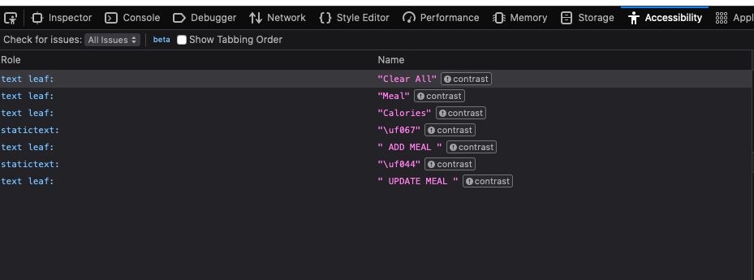

# Making Sense of Accessibility Testing

An are of testing that seems to be mostly ignored or left to the end of the development cycle is  accessibility testing. Most organisations don't have the skills in house to carryout this function and the activities involved in accessibility testing are often contracted to external organisation as an audit outside normal development sprints. 
Gaining more understanding of this area of testing is important and could reduce the issues raised by external accessibility auditors thereby reducing issues to be fixed as a result of such audits.

This post seeks to make more sense of this area of testing. I will be starting from a vary simple web page and identifying the issues with the page and then move on the fix the identified issues. 

The SUT is hosted in github. 
The following is an image of the initial look of the page:  
   

     

  

The application is a calories tracker for monitoring the number of calories that the user has consumed. The focus of this post is to identify common accessibility issues and try to resolve such issues based on the  WCAG 2.1 Level AAA accessibility standard.

## Why accessibility testing
Though majority of application users are able bodied and suffer no observable physical impediments, a significant segment of users suffer from one form of disability or the other and such users should be taken into consideration when  building applications. 
according to wikipedia, Web Content Accessibility standards are sets of recommendations for making web content more accessible for users with disabilities in addition to all users.
Checking the above page for accessibility
Taking the web page above into consideration,  the content presented on the page do not meet the accessibility standards expected for web applications. 

## Thing to consider for accessibility testing
When conducting accessibility testing,some of the tests to be conducted include: 

1. Do images have alt text or not
2. Can the user tab through the application in an understandable manner
3. Can users a all educational level use the application
4. Does each page have a page title
5. Are heading elements used correctly with h1 element being the topmost element
6. Does the content render correctly with high contrasts
7. Does the content render correctly when the font is very large
8. Is the content of the page read out correctly and understandably when the voiceover is enabled
9. Are field labels linked to the fields the refer to?

All the above considerations also apply to native devices and can be done simple by loading the application into a browser on the device. 

## Automated accessibility testing tools

There are several tools available for checking for web accessibility issues and most of them are free. Some of them include: 

- Pa11y
- Axe

## Other testing tools
The following are tools that can be installed in browsers to assist with accessibility testing. The latest version of Firefox browser comes with a few accessibility testing tools installed including the accessibility done inspector. 

- CodeSniffer
- Google ADT
- Wave

  
A more complete list of tools and there level of accuracy with finding accessibility bugs can be found at : Accessibility tools audit results - Overview - GDS accessibility team (alphagov.github.io)

Some of the above tools can be integrated into the development cycle and executed automatically when the application is built. Though it is fast and convenient to run sites through automated testing tools,  it should not be a replacement for physical user inspections.
This  is because automated testing tools are not able to find all accessibility issues.    

## Inspecting the page for accessibility issues
A simple inspection of the page will indicate that there are accessibility issues with the site.
I will be using Firefox developer edition for this and may move on to other tools later. 

The Accessibility inspector can be viewed by right clicking in the page and selecting either 'inspect accessibility properties' or 'inspect elements' from the menu that pops up.
The accessibility inspector can also be seen when the when inspecting an element. It is listed as one of the tabs.

### Tabbing
When tabbing through, the page, the location of the element that is focus gets missing along the way until the user enters into the Meal text box.
The Buttons under the text boxes are also ignored when tabbing. Any easy way to check if the element received focus is to ask javascript with 'document.activeElement'. The active element will be highlighted when you mouse over the element returned in the javascript console. In this case the buttons did not receive focus.

### Contrast

Contrast can be seen fairly easily, but a convenient way to check from the Firefox browser is to select 'all issues' from the Check for issues dropdown to the left of the developer console. This should highlight any issues identified by the browser.

This indicates that there are 7 accessibility issue all related to contrast.

Image of issues reviled by Firefox browser

We will work though the issues raised by firefox to resolve the contrast of the page. 

Adding a bit of styling to the labels that were picked up by the Firefox accessibility tool resolved the issues with the labels 

Changing the update button to blue which is same color are the other buttons on the page resolved the entire contrast problem with the page

The following is an image of what the page looks like with the changes applied to the label ans well as the "Clear all' link.

After contrast issues have been resolve

## Navigation

With contrast issue resolved, navigating around om the page is not very clear. The user is lost while navigating around the page and have no idea where their current input location is. 

In addition to the navigation issue, the "Clear All" button is actually a link that has been styled as a button and is not focusable in firefox.

With some slight styling changes, the active element is underlined with a light orange color making it possible for the user to know exactly where they are om the page.

The following is an image of the underlining on the page

Image with button underlined

