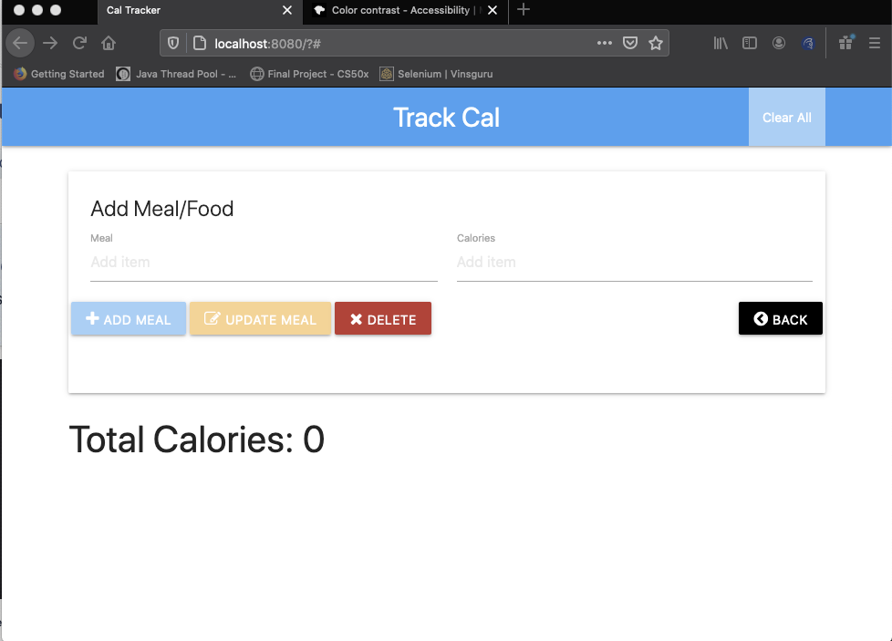

## Making Sence of Accessibility Testing

An are of testing that seems to be mostly ignored or left to the end of the development cycle is  accessibility testing. Most organizations don't have the skills in house to carryout this function and the activities involved in accessibility testing are often contracted to external organizations as an audit outside normal development sprints. 
Gaining more understanding of this area of testing is important and could reduce the issues raised by external accessibility auditors thereby reducing issues to be fixed as a result of such audits.

This post seeks to make more sense of this area of testing. I will be starting from a vary simple web page and identifying the issues with the page and then move on the fix the identified issues. 

The SUT is hosted in github. 
The following is an image of the initial look of the page:  
   
  

  

The application is a calories tracker for monitoring the number of calories that the user has consumed. The focus of this post is to identify common accessibility issues and try to resolve such issues based on the  WCAG 2.1 Level AAA accessibility standard.

Why accessibility testing
Though majority of application users are able bodied and suffer no observable physical impediments, a significant segment of users suffer from one form of disability or the other and such users should be taken into consideration when  building applications. 
according to wikipedia, Web Content Accessibility standards are sets of recommendations for making web content more accessible for users with disabilities in addition to all users.
Checking the above page for accessibility
Taking the web page above into consideration,  the content presented on the page do not meet the accessibility standards expected for web applications.  
There are several tools available for checking for web accessibility issues and most of them are free. Some of them include: 
- Pa11y
- Axe
- CodeSniffer
- Google ADT
- Wave

  

A more complete list of tools and there level of accuracy with finding accessibility bugs can be found at : Accessibility tools audit results - Overview - GDS accessibility team (alphagov.github.io)

Some of the above tools can be integrated into the development cycle and executed automatically when the application is built. Though it is fast and convenient to run sites through automated testing tools,  it should not be a replacement for physical user inspections.
This  is because automated testing tools are not able to find all accessibility issues. 